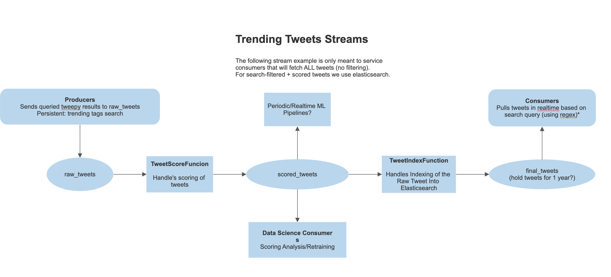

# Content Platform: Sentiment Analysis
> A data platform comprised of Twitter content and a sentiment analysis pipeline

## Architecture

- Elasticsearch
- Apache Pulsar (Stream & Stream Processing)
- FastAPI + WebSockets (Query Tweets + Sentiment Scores)
- Batch + Streaming Pipeline (Tweet Acquisition + Scoring)

## Summary
Elasticsearch stores tweets processed through pulsar and pulsar-functions.
The crawler is a set of scripts/functions that load/stream data into pulsar and parse/run's NLP Sentiment Analysis.
The API will query Elasticsearch, and trigger crawler jobs to load content into Elasticsearch.

### Run [Pulsar](https://pulsar.apache.org/docs/en/standalone-docker/) locally

```bash
docker run -it \
  -p 6650:6650 \
  -p 8080:8080 \
  --mount source=pulsardata,target=/pulsar/data \
  --mount source=pulsarconf,target=/pulsar/conf \
  apachepulsar/pulsar:2.8.1 \
  bin/pulsar standalone
```

### Run [Elasticsearch](https://www.elastic.co/guide/en/elasticsearch/reference/current/docker.html) locally

```bash
docker pull docker.elastic.co/elasticsearch/elasticsearch:7.15.2
docker run -p 127.0.0.1:9200:9200 -p 127.0.0.1:9300:9300 -e "discovery.type=single-node" docker.elastic.co/elasticsearch/elasticsearch:7.15.2
```

### Setup for Local Development

```bash
conda env create -f environment.yml
conda activate sentiment
python setup.py develop
```

### Run Webserver
```bash
./sentiment_api/scripts/runserver-dev.sh
```

### Run Batch Process: Content Acquisition and Sentiment Analysis
**Requires elasticsearch to be running on localhost:9200**

```bash
python tweet_analysis/orchestrator.py
```

## Current Build
### API Endpoints (and scheduled background tasks)
- [ ] Fetch Latest Content (param: days_back)
- [ ] Fetch Top Trending Content 
- [ ] Search for Content

### Scheduled scrape jobs
- [ ] Scrape Top Trending Tags for content -> Elasticsearch
- [ ] Perform Sentiment Analysis on content In Elasticsearch
  - [ ] query 10 mins back in ES
  - [ ] Score tweet text
  - [ ] push updates to ES

### Streaming: Future Feature 
- [ ] Pulsar Function that performs sentiment analysis on content as it is streamed into pulsar topics
  - Research pulsar-admin and how to implement in production (Dockerfile? docker_run.sh?)




# API Blueprint
- Endpoints:
  - Query a user's home timeline (tweepy)
  - Fetch tweets by keyword (elasticsearch)

Will likely need to use docker-compose.yml for easy launch of a local dev instance (pulsar and elasticsearch included)